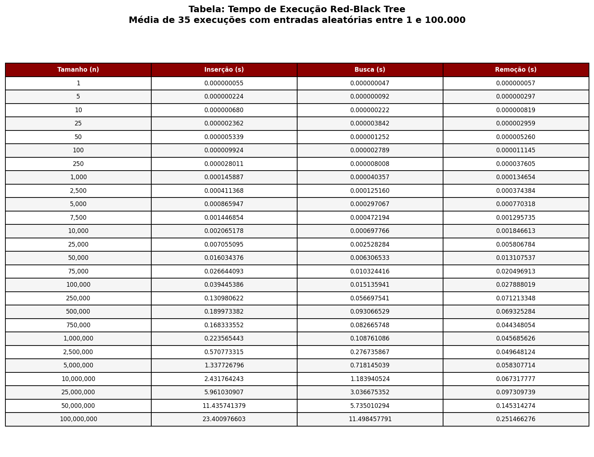
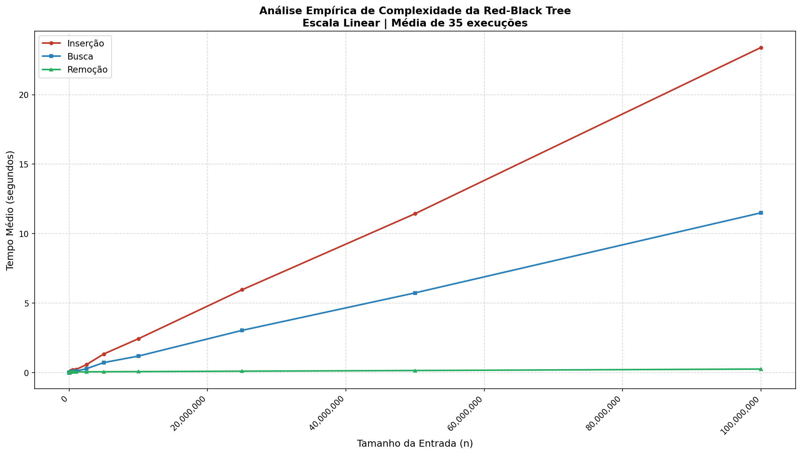

# Red-Black Tree em C

Implementação completa da estrutura de dados **Red-Black Tree** em linguagem C, com análise empírica de complexidade dos algoritmos de inserção, busca e remoção.

Desenvolvido para a disciplina **T198 - Construção e Análise de Algoritmos**  
**Prof. Bruno Lopes — Universidade de Fortaleza (UNIFOR)**

---

## 📁 Estrutura do Projeto

```text
red-black-tree/
├── src/
│   ├── rbt.h        # Structs e protótipos
│   ├── rbt.c        # Implementação completa da RBT
│   └── main.c       # Benchmark empírico
├── analysis/
│   └── plot.py      # Geração de tabela e gráfico
├── output/
│   ├── results.csv  # Resultados do benchmark
│   ├── tabela.png   # Tabela de tempos
│   └── grafico.png  # Gráfico de escala linear
└── Makefile
```

---

## ⚙️ Como Compilar e Executar

### Compilar e executar o projeto

```bash
make
./rbt
```

Os resultados serão salvos em:

```text
output/results.csv
```

### Gerar a tabela e o gráfico

```bash
pip install matplotlib
cd analysis
python3 plot.py
```

---

## 📊 Análise Empírica

Cada tamanho de entrada foi executado **35 vezes** com números aleatórios entre **1 e 100.000**. Os tempos apresentados correspondem à **média das execuções**.

### Tabela de Resultados



### Gráfico — Escala Linear



---

## 📝 Análise dos Resultados

A análise empírica foi realizada medindo o tempo médio de execução dos algoritmos de **inserção**, **busca** e **remoção** da Red-Black Tree para entradas de tamanho crescente, com 35 repetições para cada caso.

### Inserção

A inserção apresentou o maior tempo de execução entre as três operações. Isso é esperado, pois além de percorrer a árvore para encontrar a posição correta, o algoritmo executa o `insert_fixup`, responsável por rotações e recolorações que mantêm as propriedades da Red-Black Tree.

Para **n = 100.000.000**, o tempo médio foi de aproximadamente **23,4 segundos**.

### Busca

A busca foi consistentemente mais rápida que a inserção, pois apenas percorre a árvore da raiz até o nó desejado, sem modificá-la.

Como a Red-Black Tree garante altura máxima de **2·log₂(n+1)**, a busca se manteve eficiente mesmo para entradas muito grandes.

Para **n = 100.000.000**, o tempo médio foi de aproximadamente **11,5 segundos**.

### Remoção

A remoção apresentou os menores tempos entre as três operações. Isso ocorre porque:

- Duplicatas são ignoradas durante a inserção, reduzindo o número real de elementos armazenados na árvore;
- O `delete_fixup` é executado apenas quando o nó removido é preto, o que não acontece em todas as remoções.

Para **n = 100.000.000**, o tempo médio foi de aproximadamente **0,25 segundos**.

### Comportamento Geral

O gráfico em escala linear confirma o comportamento esperado de **O(n log n)** para as operações em conjunto. O crescimento dos tempos é suave e previsível, sem saltos abruptos.

A curva praticamente plana da remoção reforça a eficiência do algoritmo nesse cenário específico.

---

## 🔬 Detalhes de Implementação

- Uso de um **nó sentinela NIL** para simplificar rotações e operações de correção;
- **Duplicatas são ignoradas** durante a inserção;
- `insert_fixup` corrige violações das propriedades da árvore após inserções;
- `delete_fixup` restaura as propriedades da árvore após remoções de nós pretos;
- O benchmark utiliza `clock_gettime(CLOCK_MONOTONIC)` para medições precisas em nanossegundos.

---

## 🛠️ Tecnologias Utilizadas

- **Linguagem:** C (gcc)
- **Análise:** Python 3 + Matplotlib
- **Ambiente:** WSL / Linux

---

## 👨‍💻 Autor

**Kauam Sobreira**